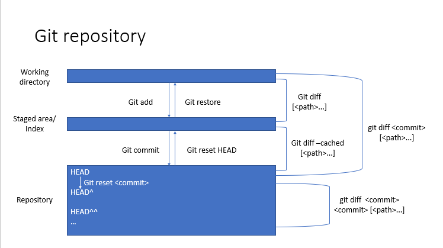
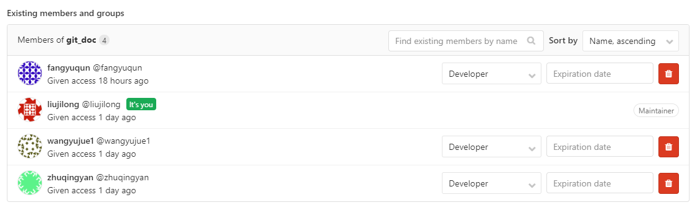
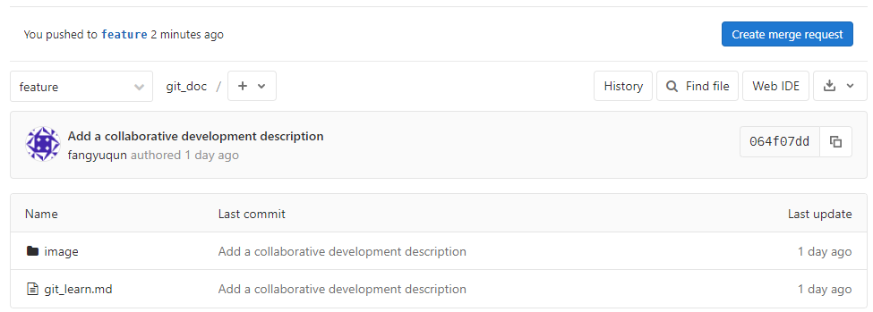
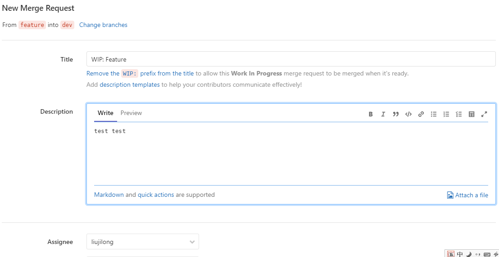
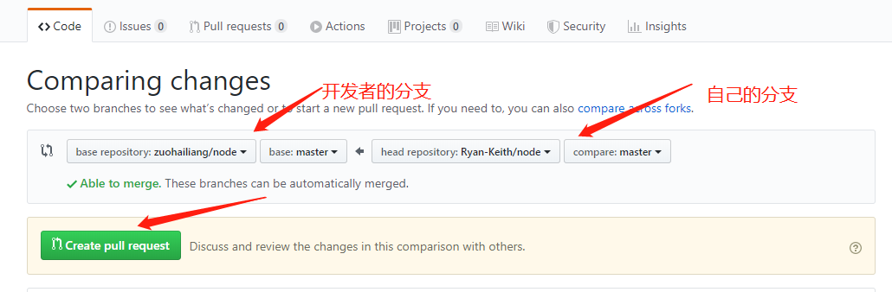

## 单版本库操作
整个git受控的文件夹构成一个版本库。文件在版本库中存在三个阶段，工作区（working directory）是我们在当前仓库中直接打开文件时能看到的版本；版本库（repository）是当前版本库与其他版本库交流（pull，push）时使用的版本。


### 增量模式
初始化git仓库
```shell
$git init
Initialized empty Git repository in /home/peta/USER/liujilong/git_learn/original_repository/virtual_project/.git/
```
`git add [path...]`用于从工作区向暂存区提交修改，`git commit`用于从暂存区向版本库提交修改。
```shell
$echo "This line will be the first commit." >readme
$git add readme
$git commit -m "first commit"

$echo "This line will be the second commit." >> readme
$git add readme
$git commit -m "second commit"

$echo "This line will be staged but not commited." >> readme
$git add readme

$echo "This line just modified in the workong directory." >>readme
```

增量操作结束，此时readme文件中的内容为：
```shell
$cat readme
This line will be the first commit.
This line will be the second commit.
This line will be staged but not commited.
This line just modified in the workong directory.
```
查看git仓库状态，readme中同时存在未暂存和未提交的修改。
```shell
$git status
On branch master
Changes to be committed:
  (use "git restore --staged <file>..." to unstage)
	modified:   readme

Changes not staged for commit:
  (use "git add <file>..." to update what will be committed)
  (use "git restore <file>..." to discard changes in working directory)
	modified:   readme
```
查看git仓库历史，共提交了两个版本。根据提交的时间自动维护顺序，最后一次的提交为HEAD，倒数第二次为HEAD^
```shell
$git log
commit c03032e5403cf4b96e30d217e0c39d19d9e92ad1 (HEAD -> master)
Author: wangyujue1 <wangyujue1@genomics.cn>
Date:   Thu Nov 28 16:07:28 2019 +0800

    second commit

commit 417709fbbc5b3d1f70d24efa2b54edc7f6d3cdbb
Author: wangyujue1 <wangyujue1@genomics.cn>
Date:   Thu Nov 28 16:06:22 2019 +0800

    first commit
```
### 改动查看
在文件夹中打开文件，仅能看到工作区的文件内容，暂存区和版本库中的内容无法直接查看，但可以通过与工作区文件的比较间接实现。

工作区与暂存区：
```shell
$git diff readme
diff --git a/readme b/readme
index 7d4a151..7010dbf 100644
--- a/readme
+++ b/readme
@@ -1,3 +1,4 @@
 This line will be the first commit.
 This line will be the second commit.
 This line will be staged but not commited.
+This line just modified in the workong directory.
```
暂存区与版本库：
```shell
$git diff --cached readme
diff --git a/readme b/readme
index 741db84..7d4a151 100644
--- a/readme
+++ b/readme
@@ -1,2 +1,3 @@
 This line will be the first commit.
 This line will be the second commit.
+This line will be staged but not commited.
```
工作区与版本库，哈希值可由HEAD代替：
```shell
$git diff c03032e5403c readme
diff --git a/readme b/readme
index 741db84..7010dbf 100644
--- a/readme
+++ b/readme
@@ -1,2 +1,4 @@
 This line will be the first commit.
 This line will be the second commit.
+This line will be staged but not commited.
+This line just modified in the workong directory.
```
版本库之间：
```shell
$git diff HEAD HEAD^ readme
diff --git a/readme b/readme
index 741db84..9f3fc90 100644
--- a/readme
+++ b/readme
@@ -1,2 +1 @@
 This line will be the first commit.
-This line will be the second commit.
```

### 后向模式
#### 版本库到暂存区
`git reset <commit>`用于从版本库向暂存区还原数据，会覆盖并丢弃掉未提交的暂存区修改，但不会对工作区产生影响。因此，此时通过`git status`查看状态，暂存区干净，与版本库一致，但工作区中存在未暂存的文件改动。查看readme文件，仍为最初工作区中的文件。
```shell
$git reset HEAD^
Unstaged changes after reset:
M	readme

$git status
On branch master
Changes not staged for commit:
  (use "git add <file>..." to update what will be committed)
  (use "git restore <file>..." to discard changes in working directory)
	modified:   readme

no changes added to commit (use "git add" and/or "git commit -a")

$git diff
diff --git a/readme b/readme
index 9f3fc90..7010dbf 100644
--- a/readme
+++ b/readme
@@ -1 +1,4 @@
 This line will be the first commit.
+This line will be the second commit.
+This line will be staged but not commited.
+This line just modified in the workong directory.
```
当指定的的commit版本号非当前HEAD时，同时产生版本库中的回滚操作。此时查看提交历史可以看到，第二次的提交记录不见了。
```shell
$git log
commit 417709fbbc5b3d1f70d24efa2b54edc7f6d3cdbb (HEAD -> master)
Author: wangyujue1 <wangyujue1@genomics.cn>
Date:   Thu Nov 28 16:06:22 2019 +0800

    first commit
```
#### 暂存区到工作区
`git restore <path...>`用于从暂存区向工作区还原文件改动，与版本库无关。工作区中的文件内容与版本库（暂存区）一致。
```shell
$git restore readme

$git status
On branch master
nothing to commit, working tree clean

$cat readme
This line will be the first commit.
```
### git受控文件范围
编译类语言以C语言为例在编译过程中会产生.o和可执行程序的二进制文件。git是基于文本格式的diff进行版本控制，对二进制文件无能为力，只能以整个文件做为控制单元。因此必须限定git受控的文件范围为图片和文本文件。

当使用`git add .` 时是使用linux系统当前文件夹的简写，会将当前文件夹下的所有文件包括二进制文件全部加入暂存区。因此对于python的程序，要使用`git add *py`的形式进行。

### git分支控制

- master：长存，稳定分支，用于生产环境
- develop：长存，开发分支，用于分配和合并开发任务
- feature：需要时建立，合并后删除。特征分支。为从dev分支中分出的具体开发任务，开发完成后合并回dev分支
- release：需要时建立，合并后删除。发布分支。为dev分支完成阶段性开发后，送测试使用。测试过程中的bug在该分支中修复后**同时向dev分支和master分支**推送。
- hotfix：需要时建立，合并后删除。缺陷分支。为生产环境出现紧急bug时建立以实现debug，修改完成后**同时向dev分支和master分支**推送。

因此，需要理解：
1. 管理员需要同时维护dev和master两个分支；
1. master分支本身永远不要做commit向前提交，其版本向前仅由分支合并驱动；
1. 在项目初始化后，dev和master分支的同步来源于release分支或hotfix分支同时向两者的提交；
1. 多人合作开发完善不同的功能应当在feature分支完成。

## 多版本库/分支间交互
`git push`和`git pull`分别向目标版本仓库推送来拉回版本。其中`git pull`是`git fetch`和`git merge`的简写。

### 场景设置
保持前文单人场景下的增量模式完成时的版本库，记为Repo1，`git clone`复制Repo1，生成Repo2。 在Repo2中修改使得Repo2的结构为：
```shell
$cat readme
This line will be the first commit.
This line will be the second commit.
This line will be commit and push to another repository.
This line will be staged but not commit in the downstream.
This line will not be staged in the downstream.

$git status
On branch master
Changes to be committed:
  (use "git restore --staged <file>..." to unstage)
	modified:   readme

Changes not staged for commit:
  (use "git add <file>..." to update what will be committed)
  (use "git restore <file>..." to discard changes in working directory)
	modified:   readme

$git diff readme 
diff --git a/readme b/readme
index 6deb4b7..d83d8ae 100644
--- a/readme
+++ b/readme
@@ -2,3 +2,4 @@ This line will be the first commit.
 This line will be the second commit.
 This line will be commit and push to another repository.
 This line will be staged but not commit in the downstream.
+This line will not be staged in the downstream.

$git diff HEAD readme
diff --git a/readme b/readme
index e089083..d83d8ae 100644
--- a/readme
+++ b/readme
@@ -1,3 +1,5 @@
 This line will be the first commit.
 This line will be the second commit.
 This line will be commit and push to another repository.
+This line will be staged but not commit in the downstream.
+This line will not be staged in the downstream.
```

### 向目标版本库递交
向目标版本库递交当前版本库成功的前提是当前版本库的commit列表必须包含目标版本库中的所有commit并领先于目标版本库。
本地被提交版本库需要更改接收权限
```shell
$git config receive.denyCurrentBranch warn
```
```shell
$git push --set-upstream /home/peta/USER/liujilong/git_learn/copyed_original_repository/virtual_project master
Enumerating objects: 10, done.
Counting objects: 100% (10/10), done.
Delta compression using up to 8 threads
Compressing objects: 100% (4/4), done.
Writing objects: 100% (6/6), 564 bytes | 564.00 KiB/s, done.
Total 6 (delta 1), reused 0 (delta 0)
remote: warning: updating the current branch
To /home/peta/USER/liujilong/git_learn/copyed_original_repository/virtual_project
   c03032e..2a89d14  master -> master
Branch 'master' set up to track remote branch 'master' from '/home/peta/USER/liujilong/git_learn/copyed_original_repository/virtual_project'.
```
此时Repo1的结构为：
```shell
$cat readme
This line will be the first commit.
This line will be the second commit.
This line will be staged but not commited.
This line just modified in the workong directory.

$git status readme
On branch master
Changes to be committed:
  (use "git restore --staged <file>..." to unstage)
	modified:   readme

Changes not staged for commit:
  (use "git add <file>..." to update what will be committed)
  (use "git restore <file>..." to discard changes in working directory)
	modified:   readme

$git diff readme
diff --git a/readme b/readme
index 7d4a151..7010dbf 100644
--- a/readme
+++ b/readme
@@ -1,3 +1,4 @@
 This line will be the first commit.
 This line will be the second commit.
 This line will be staged but not commited.
+This line just modified in the workong directory.

$git diff HEAD readme
diff --git a/readme b/readme
index e089083..7010dbf 100644
--- a/readme
+++ b/readme
@@ -1,3 +1,4 @@
 This line will be the first commit.
 This line will be the second commit.
-This line will be commit and push to another repository.
+This line will be staged but not commited.
+This line just modified in the workong directory.
```
可以看到Repo1在接收到Repo2的push后，工作区和暂存区的内容未发生变化，维持原状；但HEAD指向的版本库已经发生了变化，此时的版本库中的内容有Repo2中的三行。
即是说push操作仅发生在发生相互作用的两个版本库之间，两者工作区和暂存区的文件不受影响。当被提交的版本库的工作区和暂存区为干净状态时，push仍为该种表现形式。

### 从目标版本库拉回
恢复场景设置，现在尝试Repo1从Repo2 pull拉取修改。pull成功实现的前提是当前分支Repo1的工作区和暂存区干净，当工作区和暂存区存在信息时如下报错：
```shell
$git pull /home/peta/USER/liujilong/git_learn/original_repository/virtual_project
From /home/peta/USER/liujilong/git_learn/original_repository/virtual_project
 * branch            HEAD       -> FETCH_HEAD
error: Your local changes to the following files would be overwritten by merge:
	readme
Please commit your changes or stash them before you merge.
Aborting
```
对Repo1进行处理，暂存区信息向前提交，工作区信息回退，此时Repo1领先Repo2有一个版本点的差异，产生冲突时的行为如下：
```shell
$git commit -m "commmit for staged"
$git restore readme
```
重新执行拉取操作
```shell
$git pull /home/peta/USER/liujilong/git_learn/original_repository/virtual_project
From /home/peta/USER/liujilong/git_learn/original_repository/virtual_project
 * branch            HEAD       -> FETCH_HEAD
Auto-merging readme
CONFLICT (content): Merge conflict in readme
Automatic merge failed; fix conflicts and then commit the result.
```
显示冲突，此时Repo1中各文件的状态为：
```shell
$git status
On branch master
You have unmerged paths.
  (fix conflicts and run "git commit")
  (use "git merge --abort" to abort the merge)

Unmerged paths:
  (use "git add <file>..." to mark resolution)
	both modified:   readme

no changes added to commit (use "git add" and/or "git commit -a")

$cat readme 
This line will be the first commit.
This line will be the second commit.
<<<<<<< HEAD
This line will be staged but not commited.
=======
This line will be commit and push to another repository.
>>>>>>> 2a89d1499b585614d7660f007fba48a1f2eb5b3b

$git diff readme 
diff --cc readme
index 7d4a151,e089083..0000000
--- a/readme
+++ b/readme
@@@ -1,3 -1,3 +1,7 @@@
  This line will be the first commit.
  This line will be the second commit.
++<<<<<<< HEAD
 +This line will be staged but not commited.
++=======
+ This line will be commit and push to another repository.
++>>>>>>> 2a89d1499b585614d7660f007fba48a1f2eb5b3b

$git diff HEAD readme
diff --git a/readme b/readme
index 7d4a151..fc82f78 100644
--- a/readme
+++ b/readme
@@ -1,3 +1,7 @@
 This line will be the first commit.
 This line will be the second commit.
+<<<<<<< HEAD
 This line will be staged but not commited.
+=======
+This line will be commit and push to another repository.
+>>>>>>> 2a89d1499b585614d7660f007fba48a1f2eb5b3b
```
从中可以看到:
- 工作区的文件发生了变化，增加了git对当前分支来远程分支差异的描述
- 版本库中的内容未发生变化
- 暂存区的内容发生了变化，暂存区中现在只包含Repo1和Repo2的版本库中的公共部分，而不包含冲突部分

虽然此时Repo1的暂存区相对于版本库不是干净的，但处理被保护状态，是无法执行commit操作的：

```shell
$git commit -m "aaaa"
U	readme
error: Committing is not possible because you have unmerged files.
hint: Fix them up in the work tree, and then use 'git add/rm <file>'
hint: as appropriate to mark resolution and make a commit.
fatal: Exiting because of an unresolved conflict.
```
在工作区中做修改后暂存提交：
```shell
$cat readme 
This line will be the first commit.
This line will be the second commit.
This line will be staged but not commited.
This line will be commit and push to another repository.

$git log
commit bfb7391b4c89e5bf9e79ac6d7ddfe60e23a0edc6 (HEAD -> master)
Merge: c0c3f64 2a89d14
Author: wangyujue1 <wangyujue1@genomics.cn>
Date:   Wed Dec 4 11:02:51 2019 +0800

    commit after pull from Repo2

commit c0c3f64e05477656383490a2d9dabff0c9480391
Author: wangyujue1 <wangyujue1@genomics.cn>
Date:   Tue Dec 3 17:29:47 2019 +0800

    commmit for staged

commit 2a89d1499b585614d7660f007fba48a1f2eb5b3b
Merge: 2ebca46 c03032e
Author: wangyujue1 <wangyujue1@genomics.cn>
Date:   Fri Nov 29 09:42:06 2019 +0800

    merge from upstream

commit 2ebca46b25718eb5f2aba6466ae4704233666904
Author: wangyujue1 <wangyujue1@genomics.cn>
Date:   Thu Nov 28 19:01:19 2019 +0800

    commit for push

commit c03032e5403cf4b96e30d217e0c39d19d9e92ad1
Author: wangyujue1 <wangyujue1@genomics.cn>
Date:   Thu Nov 28 16:07:28 2019 +0800

    second commit

commit 417709fbbc5b3d1f70d24efa2b54edc7f6d3cdbb
```
此时log记录中包含了repo2中所做的改动提交，流程完成。


当Repo1 不领先Repo2时，拉取操作可直接完成，Repo1中的工作区、暂存区和版本库同时改变，Repo2中的提交记录被合并了进来
```shell
$cat readme 
This line will be the first commit.
This line will be the second commit.

$git status
On branch master
nothing to commit, working tree clean

$git pull /home/peta/USER/liujilong/git_learn/original_repository/virtual_project
remote: Enumerating objects: 10, done.
remote: Counting objects: 100% (10/10), done.
remote: Compressing objects: 100% (4/4), done.
remote: Total 6 (delta 1), reused 0 (delta 0)
Unpacking objects: 100% (6/6), done.
From /home/peta/USER/liujilong/git_learn/original_repository/virtual_project
 * branch            HEAD       -> FETCH_HEAD
Updating c03032e..2a89d14
Fast-forward
 readme | 1 +
 1 file changed, 1 insertion(+)

 $cat readme
This line will be the first commit.
This line will be the second commit.
This line will be commit and push to another repository.

$git status
On branch master
nothing to commit, working tree clean

$git log
commit 2a89d1499b585614d7660f007fba48a1f2eb5b3b (HEAD -> master)
Merge: 2ebca46 c03032e
Author: wangyujue1 <wangyujue1@genomics.cn>
Date:   Fri Nov 29 09:42:06 2019 +0800

    merge from upstream

commit 2ebca46b25718eb5f2aba6466ae4704233666904
Author: wangyujue1 <wangyujue1@genomics.cn>
Date:   Thu Nov 28 19:01:19 2019 +0800

    commit for push

commit c03032e5403cf4b96e30d217e0c39d19d9e92ad1
Author: wangyujue1 <wangyujue1@genomics.cn>
Date:   Thu Nov 28 16:07:28 2019 +0800

    second commit

commit 417709fbbc5b3d1f70d24efa2b54edc7f6d3cdbb
Author: wangyujue1 <wangyujue1@genomics.cn>
Date:   Thu Nov 28 16:06:22 2019 +0800

    first commit
```
## 多人协作
多人共同完成一个项目时，使用git的分支机制完成，分为项目团队协作和开源项目协作两个应用场景。以下**定义项目的创建者为管理员，项目的协同参与者为开发者**。
### 用户环境变量
git使用环境变量 记录当前操作者的身份。git版本库用于标识用户的变量有`user.name`和`user.email`。使用`git config user.name "Jilong Liu"`和`git config user.email "liujilong@genomics.cn"`分别设置。当以上命令添加`--golbal`选项时为git的全局变量，会对所有未设置局部变量的项目起作用。

使用`git config --list`可以查看当前设置：
```shell
$git config --list
http.sslverify=true
http.sslcapath=/home/peta/anaconda3/ssl/cacert.pem
http.sslcainfo=/home/peta/anaconda3/ssl/cacert.pem
user.email=wangyujue1@genomics.cn
user.name=wangyujue1
core.repositoryformatversion=0
core.filemode=true
core.bare=false
core.logallrefupdates=true
receive.denycurrentbranch=warn
user.name=Jilong Liu
```

### 项目团队协作(gitlab为例)
项目团队共同开发一项目时，管理员创建项目，并为项目组团队分配权限如下：

管理员初始化项目，并建立dev分支，此时该项目下共有master和dev两个分支。

当开发者承接某个具体的开发事项时，`git clone` 项目到本地，并使用`git config`配制开发者签名。此时本地版本库只包含master分支，开发者基于远程库的dev分支建立当前开发所使用的feature分支，并在feature分支中完成开发。
```shell
$git clone ssh://git@gitlab.genomics.cn:2200/liujilong/git_doc.git
Cloning into 'git_doc'...
remote: Enumerating objects: 14, done.
remote: Counting objects: 100% (14/14), done.
remote: Compressing objects: 100% (13/13), done.
remote: Total 14 (delta 1), reused 0 (delta 0)
Receiving objects: 100% (14/14), 131.52 KiB | 6.58 MiB/s, done.
Resolving deltas: 100% (1/1), done.

$cd git_doc/

$git branch -a
* master
  remotes/origin/HEAD -> origin/master
  remotes/origin/dev
  remotes/origin/master

$git branch feature origin/dev
Branch 'feature' set up to track remote branch 'dev' from 'origin'.

$git switch feature
Switched to branch 'feature'
Your branch is up to date with 'origin/dev'.
```
本地开发完成后向远程版本库提交，此时只能提交同名分支：
```shell
$git push origin feature
Total 0 (delta 0), reused 0 (delta 0)
remote: 
remote: To create a merge request for feature, visit:
remote:   https://gitlab.genomics.cn/liujilong/git_doc/merge_requests/new?merge_request%5Bsource_branch%5D=feature
remote: 
To ssh://gitlab.genomics.cn:2200/liujilong/git_doc.git
 * [new branch]      feature -> feature
```
此时在网页端项目页会出现feature分支，点击进入feature分支，并点击`create merge request`按钮

如果此时远程库中的dev分支已经发生了向前的commit，则会提示冲突，需要使用`git pull` 拉回后在本地解决冲突后再上传发起合并流程。

在设置页中正确填写From、to和描述及审核者后，点击`submit merge request`提交。


此种协作形式会**引入审核机制**，管理员会收到邮件提醒，进入gitlab中可以选择接收或者驳回。

当合并完成后，**开发者应删除feature分支。在开始下一个具体开发事项时，重新从远程dev分支建立本地feature分支进行开发**。

#### 引申
git 的分布式特征决定远程库和本地库的地方完全相同，仅为同一个版本库的clone。但gitlab提供了`merge request`，github提供了`pull request`，使得代码审核机制成为可能。项目团队当然也可以直接在本地创建多个版本库，直接进入本地推送。

### 开源项目协作(以github为例)
在开源项目协作场景下，管理员建立项目并初始化dev分支。该项目人人可见，但不是该项目的开发者。此时开发者要参与到该项目需要先fork该项目，会在开发者账号下生成一个同名项目，其实就是远程版本的`git clone`，但新生成的项目开发者有修改权限。

开发者从自己fork后的远程仓库使用`git clone`同步到本地：
```shell
$ git clone https://github.com/Ryan-Keith/node.git #（自己本地仓库项目地址）
Cloning into 'node'...
remote: Enumerating objects: 17, done.
remote: Counting objects: 100% (17/17), done.
remote: Compressing objects: 100% (11/11), done.
remote: Total 17 (delta 4), reused 15 (delta 2), pack-reused 0
Unpacking objects: 100% (17/17), done.
```
修改或添加文件，git push最新版本到自己的远程仓库，进入自己fork下的项目地址，找到new pull request按钮，如下图：

进入之后，如图选择，有Base 和 Head 两个选项。Base 是你希望提交变更的目标，Head 是目前包含你的变更的那个分支或仓库。

填写说明，帮助别人理解你的提交，然后按下"create pull request"按钮即可。
PR 创建后，管理者就要决定是否接受该 PR


#### 引申
在引入fork机制后，因为完整复制了版本库，此时可以在两个版本库的master分支之间进行操作。

## 补充

### man help
```shell
NAME
       git-branch - List, create, or delete branches

SYNOPSIS
       git branch [--color[=<when>] | --no-color] [-r | -a]
               [--list] [-v [--abbrev=<length> | --no-abbrev]]
               [--column[=<options>] | --no-column]
               [(--merged | --no-merged | --contains) [<commit>]] [<pattern>...]
       git branch [--set-upstream | --track | --no-track] [-l] [-f] <branchname> [<start-point>]
       git branch (--set-upstream-to=<upstream> | -u <upstream>) [<branchname>]
       git branch --unset-upstream [<branchname>]
       git branch (-m | -M) [<oldbranch>] <newbranch>
       git branch (-d | -D) [-r] <branchname>...
       git branch --edit-description [<branchname>]

DESCRIPTION
       If --list is given, or if there are no non-option arguments, existing branches are listed; the current branch will be highlighted with an asterisk. Option -r causes the
       remote-tracking branches to be listed, and option -a shows both local and remote branches. If a <pattern> is given, it is used as a shell wildcard to restrict the output to
       matching branches. If multiple patterns are given, a branch is shown if it matches any of the patterns. Note that when providing a <pattern>, you must use --list; otherwise the
       command is interpreted as branch creation.

       With --contains, shows only the branches that contain the named commit (in other words, the branches whose tip commits are descendants of the named commit). With --merged, only
       branches merged into the named commit (i.e. the branches whose tip commits are reachable from the named commit) will be listed. With --no-merged only branches not merged into the
       named commit will be listed. If the <commit> argument is missing it defaults to HEAD (i.e. the tip of the current branch).

       The command’s second form creates a new branch head named <branchname> which points to the current HEAD, or <start-point> if given.
```

### diff结果理解
Index: 两个版本的git hash value\
100表示普通文件，644是linux的权限代码\
--- +++分别标识的文件\
@@表示文件变动描述合并显示的开始和结束，一般在变动前后多显示3行，其中-+表示变动前后，逗号前是起始行位置，逗号后为从起始行往后几行。\
变动内容 ——+表示增加了这一行，-表示删除了这一行，没符号表示此行没有变动。

### 分布式的思考
git是分布式版本管理系统，svn为中心化版本管理系统。svn在客户端不维护版本，客户端的改动均需提交到服务器端后才进行受控，也只能从服务器端拉回其他人的修改。git在本地维护版本库，版本库可自由复制，同个项目的不同版本库之间地位相同，当前版本库可向任意其他版本库推送、从其他任意版本库拉回修改。github等远程仓库存在的意义仅为方便交换。

### git协作过程中账号系统的理解
